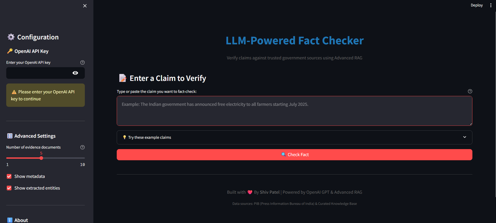

# LLM-Powered Fact Checker with Advanced RAG



An advanced fact-checking system that uses Retrieval-Augmented Generation (RAG) to verify claims against a database of trusted facts from PIB (Press Information Bureau of India) and curated knowledge base documents.

## Features

- **Advanced RAG Pipeline**: Hybrid retrieval combining vector similarity (FAISS) with keyword boosting
- **Source Tracking**: Full traceability with source IDs, types, dates, and metadata
- **LLM-Powered Analysis**: GPT-4 for intelligent fact comparison and reasoning
- **Async Architecture**: Efficient async/await implementation for API calls
- **Comprehensive Output**: Structured verdicts with confidence scores, reasoning, and evidence citations
- **CLI Interface**: Easy-to-use command-line tool

## Architecture

```
├── data/
│   ├── trusted_facts.csv      # 75 PIB verified facts
│   └── KB/                    # Knowledge base documents
├── src/
│   ├── config.py              # Configuration and 
│   ├── embedder.py            # OpenAI embedding wrapper
│   ├── indexer.py             # FAISS vector store 
│   ├── extractor.py           # Claim extraction (spaCy)
│   ├── retriever.py           # Hybrid retrieval system
│   ├── llm_compare.py         # LLM fact comparison
│   ├── nli.py                 # Optional NLI scoring
│   └── pipeline.py            # Main orchestration pipeline
```

## Setup

### 1. Install Dependencies

```bash
pip install -r requirements.txt
```

### 2. Download spaCy Model

```bash
python -m spacy download en_core_web_sm
```

### 3. Configure Environment

Create a `.env` file in the project root:

```
OPENAI_API_KEY=your_openai_api_key_here
```

### 4. Build Vector Index

```bash
cd src
python indexer.py
```

This will:
- Load 75 PIB facts from `data/trusted_facts.csv`
- Load 5 KB documents from `data/KB/`
- Generate embeddings using OpenAI
- Build FAISS index
- Save to `vector_store/` directory

## Usage

### Command Line

```bash
cd src
python pipeline.py --query "The Indian government has announced free electricity to all farmers starting July 2025." --verbose
```

### Options

- `--query`, `-q`: The claim to fact-check (required)
- `--top-k`, `-k`: Number of evidence documents to retrieve (default: 5)
- `--format`, `-f`: Output format - `pretty` or `json` (default: pretty)
- `--verbose`, `-v`: Show detailed progress
- `--output`, `-o`: Save output to file

### Example

```bash
python pipeline.py -q "PM Kisan scheme was expanded to include tenant farmers in 2024" -v -f json -o result.json
```

### Streamlit UI

Run the interactive web interface:

```bash
streamlit run app.py
```

The app will open at `http://localhost:8501`.

### Docker Compose (Recommended)

Run the entire application in a containerized environment:

1. Ensure `.env` file exists with your `OPENAI_API_KEY`.
2. Build and start the container:

```bash
docker compose up --build
```

The app will be available at `http://localhost:8501`.

- **Persistent Storage**: The vector index is saved in the `vector_store` volume.
- **Security**: Runs as a non-root user and excludes secrets from the image.

### Python API

```python
import asyncio
from pipeline import FactCheckPipeline

async def check_claim():
    pipeline = FactCheckPipeline()
    result = await pipeline.check_fact(
        claim="India launched the IndiaAI Mission in 2023",
        top_k=5,
        verbose=True
    )
    print(result)

asyncio.run(check_claim())
```

## Output Format

```json
{
  "claim": "...",
  "verdict": "True|False|Unverifiable",
  "confidence": 0.85,
  "reasoning": "Detailed explanation...",
  "evidence": [
    {
      "source_id": "PIB_7",
      "source_type": "PIB_FACT",
      "source_name": "PIB",
      "date": "2023-11-09",
      "similarity_score": 0.892,
      "text": "The Ministry of Electronics launched the IndiaAI Mission..."
    }
  ],
  "evidence_used": ["PIB_7"],
  "key_facts": ["IndiaAI Mission launched", "Focus on compute capacity"],
  "contradictions": null,
  "metadata": {
    "timestamp": "2025-11-26T11:15:00",
    "keywords_extracted": ["India", "IndiaAI Mission", "2023"],
    "entities": {...},
    "num_evidence_retrieved": 5
  }
}
```

## Sample Claims for Testing

Here are 10 sample claims you can use to test the system:

**True Claims**
1. "Prime Minister paid tribute to the framers of the Constitution on Constitution Day."
2. "CCRAS launched SIDDHI 2.0 to support innovation in the Ayurveda pharma sector."
3. "CSIR-NIScPR and CSIR-NPL organized a curtain raiser event for the India International Science Festival 2025."
4. "The Creative Minds of Tomorrow 2025 event concluded successfully with young creators presenting their work."

**False Claims**
5. "India has announced free electricity for all farmers starting July 2025."

6. "The Indian government declared 2025 as a nationwide public holiday for National Milk Day."

7. "A new national policy mandates AI tools in all government schools starting 2025."

**Unverifiable Claims**
8. "The Prime Minister hinted at a new welfare scheme during his visit to Kurukshetra."

9. "The blind women's cricket team plans to play in Australia next year."

10. "NCLT will clear all pending IBC cases by March 2025."

For a full list of 15 sample questions with expected verdicts and reasoning, see [`data/sample_questions.json`](data/sample_questions.json).

## Components

### 1. Claim Extraction (`extractor.py`)
- Uses spaCy for NLP processing
- Extracts named entities (organizations, dates, locations, etc.)
- Identifies key phrases and verbs
- Generates search keywords

### 2. Embedding (`embedder.py`)
- OpenAI `text-embedding-3-small` model
- Async batch processing
- Error handling and retry logic

### 3. Vector Store (`indexer.py`)
- FAISS IndexFlatIP for cosine similarity
- Document metadata tracking
- Loads PIB facts and KB documents
- Persistent storage

### 4. Retrieval (`retriever.py`)
- Hybrid search: vector similarity + keyword boosting
- Configurable top-k retrieval
- Similarity threshold filtering
- Full metadata preservation

### 5. LLM Comparison (`llm_compare.py`)
- GPT-4o-mini for cost efficiency
- Structured JSON output
- Detailed reasoning generation
- Source citation tracking

### 6. Pipeline (`pipeline.py`)
- Async orchestration of all components
- Progress tracking
- Multiple output formats
- CLI and API interfaces

## Testing Individual Components

Each module can be tested independently:

```bash
# Test extractor
python extractor.py

# Test retriever
python retriever.py

# Test LLM comparison
python llm_compare.py

# Test NLI (optional)
python nli.py
```

## Advanced Features

### Optional NLI Scoring

For additional entailment scoring, install transformers:

```bash
pip install transformers torch
```

Then use in your code:

```python
from nli import get_nli_scorer

scorer = get_nli_scorer()
label, score = scorer.score_entailment(evidence, claim)
```

## Performance

- **Indexing**: ~30-60 seconds for 80 documents
- **Query Time**: ~2-4 seconds per fact-check
- **Embedding Cost**: ~$0.0001 per query
- **LLM Cost**: ~$0.001-0.005 per query (GPT-4o-mini)

## Data Sources

- **PIB Facts**: 75 verified government press releases (2023-2025)
- **KB Documents**: 5 curated context documents on:
  - Energy policy and farmers
  - Agriculture updates
  - Digital governance
  - Culture and governance events
  - Science research and innovation

## Future Enhancements

- [ ] Confidence scoring improvements
- [ ] Multi-language support
- [ ] Fact database expansion
- [ ] Caching layer for repeated queries
- [ ] Batch processing API


